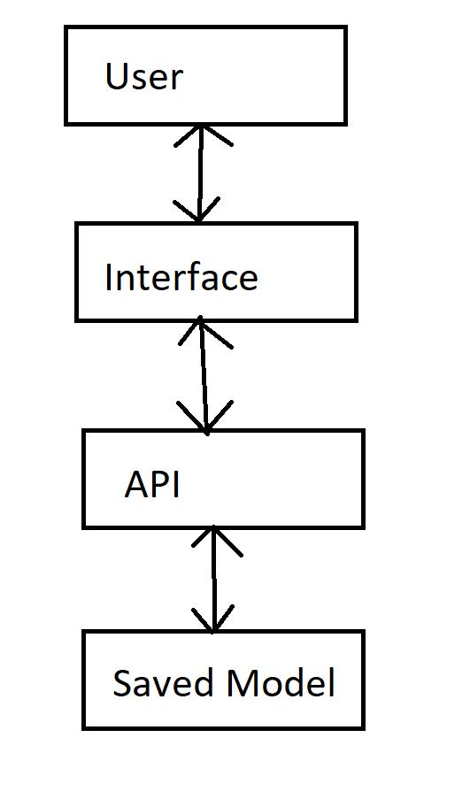

# House price prediction

## Author
**Name:** Adam Hlaváčik  
**Contact:** hlavacik@spsejecna.cz

**Date of Completion:** 3.4.2025  
**Institution:** Střední průmyslová škola elektrotechnická, Praha 2, Ječná 30  
**Type of project:** School project


## Project Overview
This project is a application writen in Python and is used to predict a price of house based on given attributes in a web UI.


## Application Architecture


- User
  - This is the client that acceses this app.
- Interface
  - This is web interface that is used to recive and show data.
- API
  - This is used to recive data from interface and used model to predict price and send prediction back.
- Saved Model
  - This is the pre trained model used to make future prediction.


## Configuration Options
Configurations are set in `/backend/api/config.json`:
- `api`: Dictionary containing api configuration.
- simulation
  - `ip`: Ip to use for the api
  - `port`: Port used in api
  - `debug` : Wheater to use debug or not

Refer to `/backend/api/config.json` for valid configuration.


# Documentation and Reporting
### Overview
This application predicts house prices based on user input recived from react frontend that is then send to backend via flask. The backend processes the data and uses a trained model to generate a price prediction.

### How It Works
1. **Frontend (React)**:
   - React web page build using MUI library to enter house details (e.g., number of rooms, location, etc.).
2. **Backend (Flask API)**:
   - Handles requests from React, preprocesses data, predicts price with pre trained model and returns prediction.

## Sources and consulted
- [Sreality codes for regions districts and etc.](https://github.com/tomFlidr/sreality-configurable-rss/blob/master/config.php)
- ChatGPT
  - CSS for web
    - [Link 1](https://chatgpt.com/share/67e80827-58d8-8003-80bb-67901bdd3a9c)
    - [Link 2](https://chatgpt.com/share/67e8083e-6a7c-8003-9ede-6a4ce037e209)
    - [Link 3](https://chatgpt.com/share/67e80856-d058-8003-9d74-d6818e44cb4c)
  - [SReality api guide](https://chatgpt.com/share/67ee9535-2cf0-8003-adc5-c4d8dc76e502)
- Martin Hornych
- Tomáš Križko
- Ondra Kábrt


## Installation
### Dependencies
- Python 3.x installed.
- Nodejs

### How to run
1. Clone the project from `https://github.com/Sharkpb8/Omega_AI`.
2. Naviagte to project folder using powershell
3. Execute these comands:
```bash
   python3 -m venv venv
   ./venv/Scripts/pip.exe install -r ./requirements.txt
   ```
5. Start api using this command:
```bash
& disk:/path/to/project/Omega_AI/venv/Scripts/python.exe disk:/path/to/project/Omega_AI/backend/api/routes.py
```
6. navigate to `frontend`
2. Execute this command:
```bash
npm i
```
8. Then start the react app using:
```bash
npm run dev
```
9. open this url in web browser: [http://localhost:5173](http://localhost:5173)